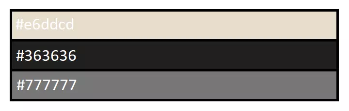
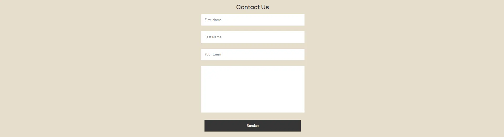
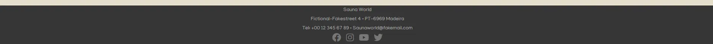
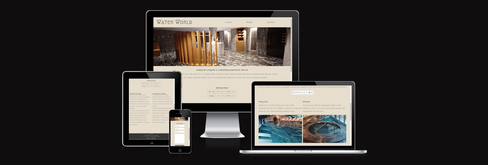
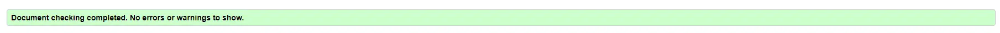
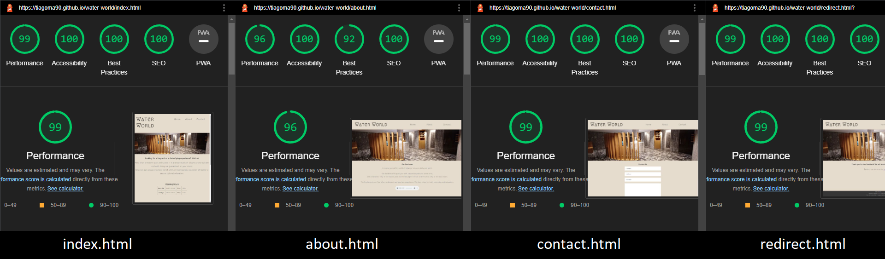
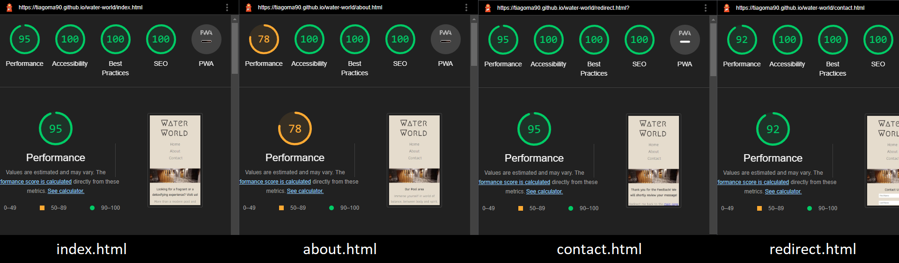

# Sauna World

The 'Sauna World' website is an informative page for people who want to visit our Spa/Sauna facilities.

Visitors of this website will find useful information about our Spa.
Opening times, current price listings, contact information, furthermore to be able to share their opinion about our services.
The website is targeted to people who are looking for leisure activities, wellness and therapeutic experiences.

# Live Project
The live website can be found [here](https://tiagoma90.github.io/sauna-world/index.html).

## Purpose of the website.
- To promote the Spa facilities and attract consumers, in and outside the area.
- To inform guests and give an idea to users about the Saunas and services.
- To invite and inspire users to visit and regularly attend the Spa.

## Target Audience
- People who want to take advantage of wellness and leisure through relaxation, after physical activities, such as sport.
- People who are primarly in search of therapy as a way to improve their health conditions.

## Design and Styling
- The website was designed with the intent of having a colour pallete of contrast, that are in parallel with the Spa itself.
- The color Hex #e6ddcd would then emulate the wooden properties of the Sauna while the #363636 and #777777 would mimic stone surfaces of the same.

- The Fonts used for the titles and text is [Athiti](https://fonts.google.com/specimen/Athiti?query=athiti).

## Navigation:
- The Icon is located at the Top-Left of the screen entitled Sauna World. It makes use of [Megrim](https://fonts.google.com/specimen/Megrim?query=megrim) fonts.
- Located at the Top-right corner of the screen is our menu with "Home", "About" and "Contact" tabs that directs users to diferent pages linked within this website.
- The links are highlighted when the cursor hovers over the selected elements, giving a much more intreactive feeling to it.

UPDATE THIS PICTURES

## Header
- Is a background image of the common area of our Sauna area. It gives the users an idea of how our public facilities looks like.

## Index:
- The "Index" page gives information and lets the user know what the site is about.
- It gives a brief introduction to our services and the opening times of our facilities.

## About:
- The "About" page gives a slightly detailed description of the Saunas we have in our Spa.
- It includes icons imported from FontAwesome, and briefly describes the tempearte, humity and average time a guest should be in a particular sauna.

## Contact:
The "Contact" page lets users provide feedback about their experiences and our services. Users are required to provide their email in order to submit their message.
The Form consists of the following fields (labels have been hidden, making use of the placeholder instead):

- First Name (not required)
- Last Name (not required)
- Email (required)
- Message (required)

Once a message has been submited, users are directed to another page (redirect.html), while being greeted with a "Thank you" message and asking them to be redirected to the "Home" page.

## Footer
- The Footer is displayed in all pages, found at the bottom of the screen with useful information for the user.
- It also includes links to the social media sites that open on external pages. Furthermore, it lets users access explore other platforms where the website Sauna is being promoted.
- The use of icons was imported from FontAwesome.

# Assay

## Testing:
- This project was tested under Chrome DevTools, using the Device Tool bar.

- This project is responsive and displays a pleasing style to viewers, with colors contrasting each other. (In particular: Text #363636 & Background: #e6ddcd);
- The links work and are correctly assigned, allowing users to easily navigate between the pages within the wesite, on any given device.
- The Form works accordingly, where users are required to input their e-mail and message before sending any feedback. The action is set to direct users to a greeting page and the method is set to "post". (The first and last names are not mandatory and therefore optional.)
- The website was tested in browsers Chrome, Firefox and Edge for its compatibility.
- The website was tested for responsiveness and its viewports, under [bytes.dev](https://ui.dev/amiresponsive?url=https://tiagoma90.github.io/Portfolio-one/index.html)

# Validation:
All .html and .css pages of this website were validated through [validator.w3.org](https://validator.w3.org/#validate_by_input) and found no errors or warnings whatsoever, via URL and Direct Input.

# DevTools & Lighthouse

- All pages were scanned for Performance, Accessibility, Best Practices and SEO for both Desktop and Mobile devices under the Lighthouse function provided by Chrome DevTools, with favorable scores.

// Delete & Update pictures here //
## Desktop:

## Mobile:

## Technologies

Languages
- HTML5 - Structure
- CSS3 - Style

Other
- Tiny PNG - Image compresser
- Convertio - Image converter
- Font Awesome - Source of icons
- Github - Host of repository
- Gitpod - Code editor
- Chrome DevTools - Tester
- WAVE Evaluation tool - Tester

## Development & Deployment
- The project was developed using GitHub and GitPod platforms.
- The website was deployed via Github and the live version can be found [here](https://tiagoma90.github.io/sauna-world/)

# Credits

## Content:
- The text on this site was written my the author of this Website himself.
- The Fade-in transition for @keyframes on this website, was implememted following the tutorial in this [blog post](https://blog.hubspot.com/website/css-fade-in#image-transition)

## Fonts & Icons:
- The Fonts displayed in this website were imported from [Google Fonts](https://fonts.google.com/knowledge)
- The Icons displayed in this website were imported from [FontAwesome](https://fontawesome.com/)

## Media:
- The images in this website were photographed by the Author of this Website himself.
- The music displayed on "About" page is entitled "Bless those tired eyes" performed by Clem Leek and © 2012 Brian Records.