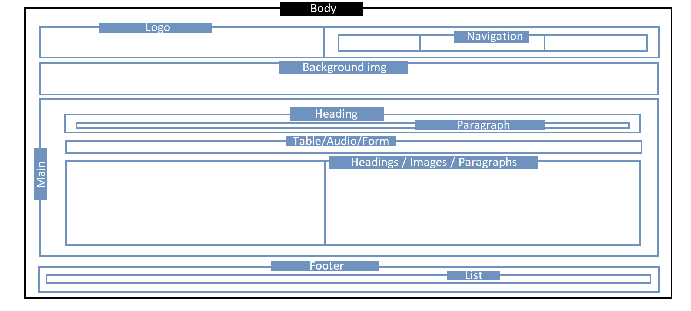
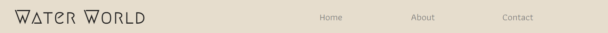
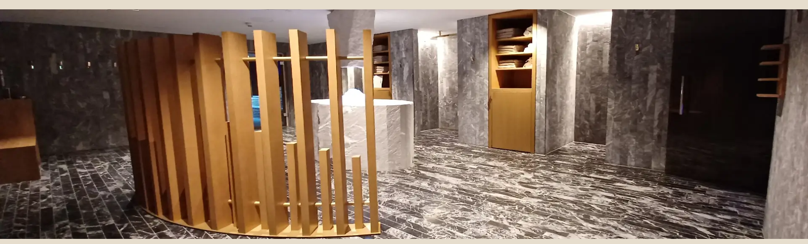
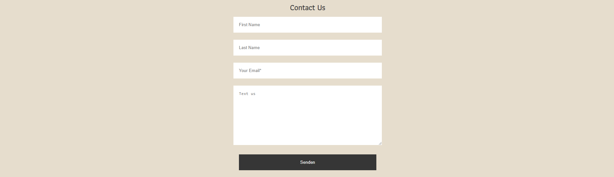
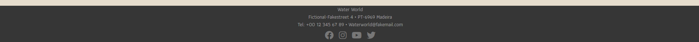
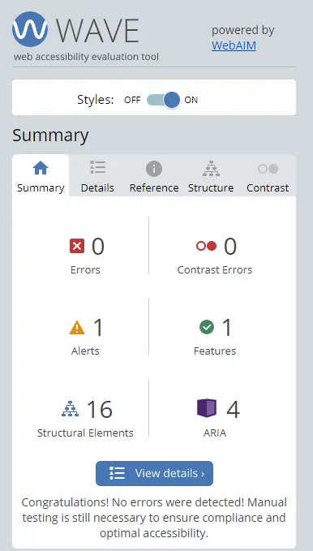

# Water World

The 'Water World' website is an informative page for people who want to visit our Spa/Sauna facilities.

Visitors of this website will find useful information about our Spa.
Opening times, current price listings, contact information, furthermore to be able to share their opinion about our services.
The website is targeted to people who are looking for leisure activities, wellness and therapeutic experiences.

# Live Project
The live website can be found [here](https://tiagoma90.github.io/water-world/index.html).

## Purpose of the website.
- To promote the Spa facilities and attract consumers.
- To inform guests and give an idea to users about the our Swimming pools, Saunas and services.
- To invite and inspire users to visit and regularly attend the Spa.

## Target Audience
- People who want to take advantage of wellness and leisure activities.
- People who are primarly in search of therapeautic programs as a way to improve their health conditions.

# Process
## Skeleton
The website was designed and structured with divs grouped and organized in grids of fractions, to make the content of the website clean.
- The body has a main div under the class "container" that collects all elements, with the exception of the footer, to keep it below the main content.
- Inside the main the we find h2, table, p, ul, furthermore img, audio and form tags for its respective pages.
- The structure of the page can be more or less defined and follows the skeleton for the overall website as seen below:

## Design and Styling
The website was designed with the intent of having a colour pallete of contrast to each other, that is in parallel with the Spa itself.
- The color Hex #e6ddcd would then emulate the wooden properties of the Sauna while the #363636 and #777777 would mimic stone surfaces of the same.

- The Fonts used for the Logo was [Megrim](https://fonts.google.com/specimen/Megrim) which gives a sophisticated and somewhat stylish look to the logo.
- The Fonts used for the titles and text is [Athiti](https://fonts.google.com/specimen/Athiti?query=athiti), giving an accessible and readable style to the users.

# Overview & Features
## Navigation:
The Navigation bar is divided into 3 sections.
- The Icon is located at the Top-Left of the screen entitled Sauna World. It makes use of [Megrim](https://fonts.google.com/specimen/Megrim?query=megrim) fonts.
- Located at the Top-right corner of the screen is our menu with [Home](https://tiagoma90.github.io/water-world/index.html), [About](https://tiagoma90.github.io/water-world/about.html) and [Contact](https://tiagoma90.github.io/water-world/contact.html) tabs that directs users to diferent pages linked within this website.
- The links are highlighted when the cursor hovers over the selected elements, giving a much more intreactive feeling to it.

## Header/Background image
- Is a background image of the common area of our Sauna area. It gives the users an idea of how our public facilities looks like.

## Index:
The "Index" page gives information and lets the user know what the site is about, through informative slogans.
- It gives a brief introduction to our Spa services and the opening times/prices for the Spa facilities.
- Users are quick to understand what this website is about.

## About:
The "About" page gives a slightly detailed description of the Pool and Saunas areas of the Spa.
- In sum, images with descriptive text organized one after the other. It lets users scroll down and have a brief idea of the services.
- It includes icons imported from [FontAwesome](https://fontawesome.com/), and briefly describes the temperature, humity and average time a guest should be in a particular sauna.
- An Audio player is availabe with a song entitled "Bless those tired eyes". The Audio player does not automatically play to prevent unwanted sound for abetter user experience. 

## Contact:
The "Contact" page lets users provide feedback about their experiences and services. Users are required to provide their email in order to submit their message.
The Form consists of the following fields (labels have been hidden, making use of the placeholder instead):

- First Name (not required)
- Last Name (not required)
- Email (required)
- Message (required)

Once a message has been submited, users are directed to another page [Redirect](https://tiagoma90.github.io/water-world/redirect.html?), while being greeted with a "Thank you" message and asking them to redirect themselves to the "Home" page via the provided link.

## Footer
The Footer is displayed in all pages, found at the bottom of the screen with useful information for the user.
- It displays Street address, Postal code, Telephone number and E-mail.
- It also includes links that externaly open Social media websites (Facebook, Instagram, Youtube, Twiter). Its purpose, to let users explore other platforms where the website Water World is being promoted.

# Assay

## Testing:
This project was tested under Chrome DevTools, using the Device Tool bar.
- The website is responsive and displays a pleasing style to viewers, with colors contrasting each other.
- The links work and are correctly assigned, allowing users to easily navigate between the pages within the website, on any given device.
- The Form works accordingly, where users are required to input their e-mail and message before sending any feedback. The action is set to direct users to a greeting page.
- The audio player plays in accordance to the Play button and users can adjust the valume, if necessary.
- Social media links open in external pages, to each respective icon.

The website is fully responsive on all screen sizes
- Testing was performed under Chromes Device Toolbar, by resizing and downsizing all pages.

The website was tested in different Web browsers
- Testing was done in Chrome, Firefox and Edge for its compatibility.

The website was tested using chromes extension WAVE Web Accessibility Evaluation Tool.
- Testing and examination was for all its pages and retrieved no Errors or Contrast errors.

The website was tested for responsiveness and its viewports.
- Testing was conducted under [bytes.dev](https://ui.dev/amiresponsive?url=https://tiagoma90.github.io/Portfolio-one/index.html)

# Validation:
All .html and .css pages of this website were validated through [validator.w3.org](https://validator.w3.org/#validate_by_input) & [jigsaw.w3.org](https://jigsaw.w3.org/css-validator/validator) and found no errors or warnings whatsoever, via URL and Direct Input.
Write custom HTML code that passes through the official W3C validator with no issues.
- HTML code that passed through the official W3C validator with no issues.
- CSS code that passed through the official (Jigsaw) validator with no issues

    
    

      

# DevTools & Lighthouse

All pages under Ingognito mode were scanned for Performance, Accessibility, Best Practices and SEO for both Desktop and Mobile devices under the Lighthouse function provided by Chrome DevTools, with favorable scores.
- All pages returned very positive ratings well above 90%, with the exception of the about.html page on Mobile devices, which falls 78% due to its image contents.

## Desktop:

## Mobile:

## Technologies

Languages
The website was written under HTML5 and CSS3.
- HTML5 - Structure of the page
- CSS3 - Style of the page

Other forms of development as follows:
- [Tiny PNG](https://tinypng.com/) - Image compresser
- [Convertio](https://convertio.co/de/png-webp/) - Image converter
- [Font Awesome](https://fontawesome.com/) - Source of icons
- [Google Fonts](https://fonts.google.com/) - Source of fonts
- [Github](https://github.com/) - Host for the repository
- [Gitpod](https://gitpod.io/) - Code editor
- Chrome DevTools - Testing tool
- [WAVE Evaluation tool](https://chrome.google.com/webstore/detail/wave-evaluation-tool/jbbplnpkjmmeebjpijfedlgcdilocofh) - Testeing tool

## Development & Deployment
The project was developed using GitHub and GitPod platforms.

- Navigate to: "Repositories" and create "New".
- Mark the following fields: ✓ Public ✓ Add a README file.
- Select template: "Code-Institute-Org/gitpod-full-template".
- Add a Repository name: "water-world".
- And create Repository.

This project was developed using GitPod and suffered various executions using the inbuild Terminal.
- git add . - Command used before commiting.
- git commit -m "written imperative declaration" - Command used to declare changes and updates.
- git push - Command used to push all updates to the GitHub Repository and live version.
- python -m http.server 8000 - Command used to load the website on port 8000.

The website was deployed via Github
- Under the given Repository, navigate to "Settings".
- Navigate to "Pages" from the left-hand bar.
- From here the "Source" should be set to "Deploy from branch"
- On "Branch" select "main" and save.

The website was deployed via Github and the live version can be found [here](https://tiagoma90.github.io/sauna-world/)

# Credits

## Content:
- The text on this site was written by the author of this Website himself.
- [codeinstitute](https://learn.codeinstitute.net/ci_program/diplomainfullstacksoftwarecommoncurriculum) was used as guidance platform for the development of this project.
- [w3schools](https://www.w3schools.com/) was used as guidance for mistakes and errors of thid project.
- [Web Dev Simplified](https://www.youtube.com/@WebDevSimplified) and  was used as guidance for CCS grids in this project.
- The Fade-in transition for @keyframes on this website, was implememted following the tutorial in this [blog post](https://blog.hubspot.com/website/css-fade-in#image-transition)

## Fonts & Icons:
- The Fonts displayed in this website were imported from [Google Fonts](https://fonts.google.com/knowledge)
- The Icons displayed in this website were imported from [FontAwesome](https://fontawesome.com/)

## Media:
- The images in this website were photographed by the Author of this Website himself.
- The music displayed on "About" page is entitled "Bless those tired eyes" performed by Clem Leek and © 2012 Brian Records.